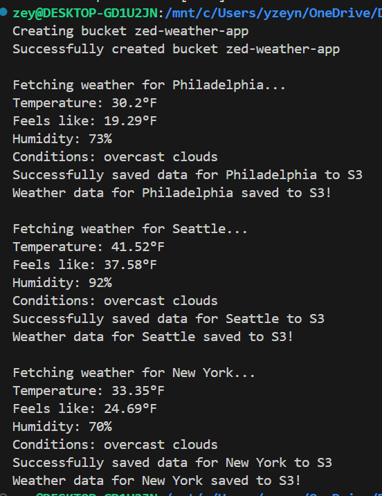

# SkyCast - Your Ultimate Weather Companion

 SkyCast is a dynamic weather dashboard that provides real-time weather updates and securely stores them in AWS S3 for future analysis. Whether you're planning a trip or just curious about the weather, SkyCast offers an easy and reliable way to access current conditions across multiple cities.


 ### 🌤️ SkyCast App Demo


## 🌍 How It Works

Using SkyCast is super easy!

- Pick a city from the homepage.

- SkyCast fetches the weather using OpenWeather API.

- You get all the details - temperature, humidity, and conditions.

- Your data gets stored securely in AWS S3.

- Example of what you get back from the API:
```bash 
{
  "temp": 18.1,
  "feels_like": 17.0,
  "humidity": 60,
  "description": "partly cloudy"
}

```

---

###  AWS S3 Real-Time Storage Demo


## Features

-  Retrieve up-to-date weather information for selected cities.
- Weather reports are automatically stored securely in the cloud.
- A clean and responsive design suitable for all devices.
-  Easily extend to support additional cities and features.
- Leveraging OpenWeather API for precise weather conditions.


##  Installation and Setup

Follow the steps below to install and run SkyCast on your local machine.

 ### 1. Clone the Repository

```bash 
git clone https://github.com/zyusuf88/skycast.git`

cd skycast
```

### 2. Backend Setup

Navigate to the backend folder:

```bash
cd backend
```

#### Install the required dependencies:

```bash 
pip install -r requirements.txt
```

#### Create a .env file in the backend/ directory with the following credentials:

```bash
OPENWEATHER_API_KEY=your_openweather_api_key
AWS_BUCKET_NAME=your_s3_bucket_name
```

#### Run the Flask server:

```bash
python weather_dashboard.py
```

### 3. Frontend Setup

Navigate to the src/ folder and open index.html in your browser:
```bash
file:///path_to_project/src/index.html
```



